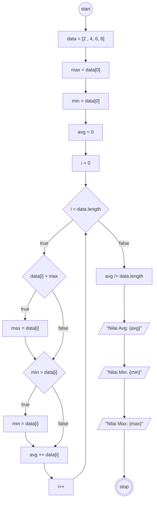

# JavaScript 2

## MiniTask 1

Membuat FlowChart untuk program hitung nilai proses,

- Max
- Min
- Average

```mermaid
flowchart TD
  aa@{shape: circle, label: "start"}
  a@{shape: rect, label: "data = [2 , 4, 6, 8]"}
  b@{shape: rect, label: "max = data[0]"}
  c@{shape: rect, label: "min = data[0]"}
  d@{shape: rect, label: "avg = 0"}
  e@{shape: rect, label: "i = 0"}
  fr@{shape: diamond, label: "i < data.length"}
  g@{shape: diamond, label: "data[i] > max"}
  h@{shape: rect, label: "max = data[i]"}
  i@{shape: diamond, label: "min > data[i]"}
  j@{shape: rect, label: "min = data[i]"}
  k@{shape: rect, label: "avg += data[i]"}
  l@{shape: rect, label: avg /= data.length}
  m@{shape: lean-r, label: '"Nilai Avg: {avg}"'}
  n@{shape: lean-r, label: '"Nilai Min: {min}"'}
  o@{shape: lean-r, label: '"Nilai Max: {max}"'}
  ii@{shape: rect, label: i++}
  zz@{shape: dbl-circ, label: "stop"}


  aa-->a
  a-->b-->c-->d-->e-->fr
  fr--true-->g--true-->h-->i--true-->j-->k-->ii-->fr
  g--false-->i
  i--false-->k
  fr--false-->l-->m-->n-->o
  o-->zz
```